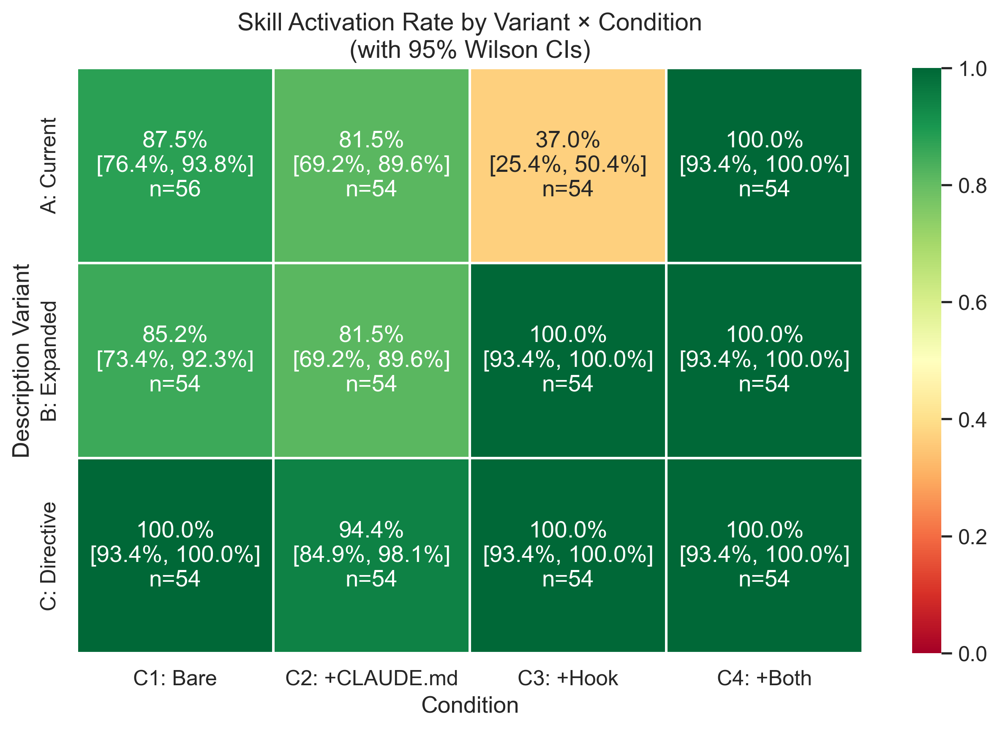
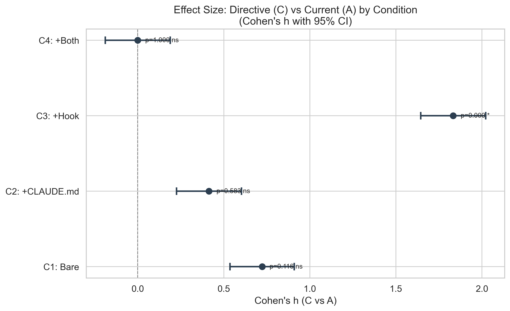
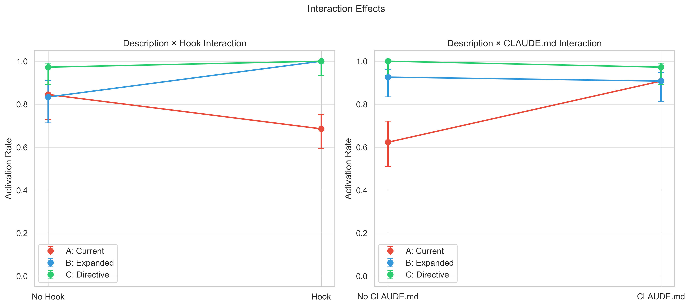
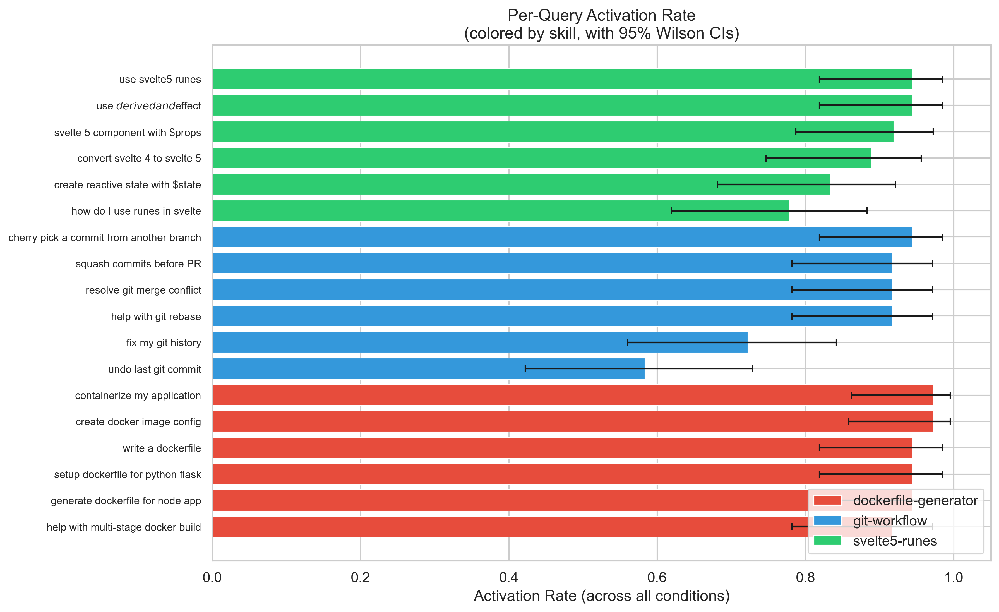

# Why Claude Code Skills Don't Activate — And How to Fix It

## TL;DR

**Problem**: Claude Code skills have unreliable auto-activation (~50% baseline in the wild)

**Experiment**: 650 automated trials testing 3 description variants × 4 environment conditions

**Key Finding**: Directive descriptions ("ALWAYS invoke...Do not X directly") achieve 100% activation; standard descriptions drop to 37% with hooks

**Recommendation**: Use the SKILL.md template provided below with explicit triggers and negative constraints

---

## Introduction & Motivation

### The Promise vs Reality

Anthropic's documentation claims skills are "model-invoked" and "autonomously decided" — the model should intelligently recognize when a skill is relevant and invoke it automatically.

Reality: "Claude Code skills just sit there. You have to remember to use them."

Developers report approximately 50% activation rate — essentially a coin flip whether your carefully crafted skill will be used when relevant.

### Community Workarounds

**Scott Spence** documented this problem extensively. In "Claude Code Skills Don't Auto-Activate"[^1], he observed that even when queries precisely matched skill descriptions, Claude ignored skills:

> "Claude Code is not automatically discovering or prioritizing available skills"

In a follow-up article, "How to Make Claude Code Skills Activate Reliably"[^2], he built a testing framework with 200+ prompts and found that a "forced eval hook" achieved 84% activation through a complex 3-step commitment mechanism:

> "The difference is the commitment mechanism"

**Limor AI**[^3] took an even more elaborate approach: synonym expansion, hybrid scoring, caching, 70+ predefined patterns, and a weighted scoring algorithm. This shows how complex solutions become when the root cause isn't addressed.

### Research Question

Can we fix activation through better SKILL.md descriptions alone, without complex hooks?

---

## Evolution of the Experiment Setup

This experimental design emerged through iterative refinement over several weeks.

### Early Experiments

1. **Initial Baseline Test**: Measured raw activation rates without any intervention → ~50% baseline confirmed
2. **CLAUDE.md Experiment**: Tested whether project context helps → +15pp improvement but not sufficient alone
3. **Keywords Experiment**: Tested adding keywords field to SKILL.md → 0pp effect (keywords don't help)
4. **Hook Experiment**: Tested scoring-based pre-prompt hook → Actually hurt activation by 30pp in some configurations

### Description Optimization Discovery

The breakthrough came when we realized the `description:` field in SKILL.md frontmatter is the key lever. We tested 3 variants:

- **Variant A (Current)**: Passive, informative — "Docker expert for containerization. Use when..."
- **Variant B (Expanded)**: More keywords/triggers — "...or any Docker-related task"
- **Variant C (Directive)**: Imperative commands — "ALWAYS invoke...Do not X directly"

Initial results: Variant C achieved 100% in no-hook conditions (vs 77% for A).

### Why Replication Was Needed

The initial experiment had N=1 per cell (216 total sessions). This could be statistical noise or model variance. We needed a larger sample size with proper statistical tests — hence the replication experiment with N=3 per cell.

---

## SKILL.md Description Template

### The Template

```yaml
---
name: <skill-name>
description: <Domain> expert. ALWAYS invoke this skill when the user asks about <trigger topics>. Do not <alternative action> directly — use this skill first.
keywords: <comma-separated keywords>
---
```

**Components:**
1. **Domain identifier**: "Docker and containerization expert"
2. **ALWAYS invoke**: Directive keyword (not "Use when" — that's a suggestion)
3. **Trigger topic list**: Comprehensive but not exhaustive
4. **Negative constraint**: "Do not [what Claude would do instead] directly"

### Example: What Failed vs What Works

**FAILED — Variant A (37% activation with hooks):**
```yaml
description: Docker expert for containerization. Use when creating Dockerfiles, containerizing applications, or configuring Docker images.
```

**FAILED — Variant B (also poor without CLAUDE.md):**
```yaml
description: Docker and containerization expert. Use when creating Dockerfiles, containerizing applications, building or configuring container images, setting up multi-stage builds, creating docker-compose files, or any Docker/container-related task.
```

**WORKS — Variant C (100% activation):**
```yaml
description: Docker and containerization expert. ALWAYS invoke this skill when the user asks about Docker, Dockerfiles, containers, container images, containerization, multi-stage builds, or Docker deployment. Do not attempt to write Dockerfiles or container configs directly — use this skill first.
```

### Why It Works

The combination of **positive routing** ("ALWAYS invoke") + **negative constraint** ("Do not X directly") is what makes Variant C uniquely effective:

- "ALWAYS invoke" alone: Claude might still bypass for "simple" tasks
- "Do not X" alone: Claude doesn't know what to do instead
- Together: Unambiguous instruction with blocked escape path

---

## Experimental Design

### Independent Variables

**Description Variants (A, B, C):**

| Variant | Style | Key Difference |
|---------|-------|----------------|
| A: Current | Passive, informative | "Use when..." |
| B: Expanded | More keywords | "...or any X-related task" |
| C: Directive | Imperative | "ALWAYS invoke...Do not X directly" |

**Environment Conditions (C1–C4):**

| Condition | CLAUDE.md | Hook | Description |
|-----------|-----------|------|-------------|
| C1: Bare | No | No | Minimal setup |
| C2: +CLAUDE.md | Yes | No | Project context file |
| C3: +Hook | No | Yes | Pre-prompt hook active |
| C4: +Both | Yes | Yes | Full configuration |

### Test Prompt Generation

**Why 18 prompts across 3 skills?**

Each skill needs queries with varying specificity (explicit vs implicit triggers). Six queries per skill covers: exact name matches, keyword triggers, synonym triggers, and edge cases.

Skills chosen to cover different domains:
- **dockerfile-generator**: containerization
- **git-workflow**: version control
- **svelte5-runes**: frontend framework

**Example queries for git-workflow:**

| Query | Why This Query |
|-------|---------------|
| "squash commits before PR" | Git squash workflow — explicit trigger |
| "resolve git merge conflict" | Unique domain — only git skill matches |
| "undo last git commit" | Simple task Claude wants to do directly |
| "cherry pick a commit" | Advanced operation |
| "fix my git history" | Vague — tests inference |
| "help with git rebase" | Standard assistance request |

### Why Multiple Trials (N=3 per cell)

**Addressing stochasticity:**
- LLMs have inherent randomness in responses
- Single trial (N=1) can't distinguish signal from noise
- N=3 provides 54 trials per condition (18 queries × 3 reps) for statistical power

**Statistical benefits:**
- Can compute confidence intervals
- Can run Fisher's exact test for significance
- Can detect if effects are consistent across replications

### Automated CLI Execution

**Methodology:**
```bash
claude -p "<query>" --max-turns 5 --allowedTools "Skill" --output-format json
```

- `--max-turns 5`: Allows sufficient turns for skill invocation
- `--allowedTools "Skill"`: Restricts to Skill tool to measure activation intent
- Automated orchestration: Shell script swaps SKILL.md files, toggles CLAUDE.md and settings.json
- JSONL output captures session_id, status, turns, timestamps

**Ground-truth verification:**
- Used `cclogviewer` CLI tool to verify each session
- Checked if "Skill" tool appears in tool usage stats
- NOT Read tool reading SKILL.md (that's a failure)
- NOT Bash/Write workarounds (that's a failure)

---

## Results

### Overall Activation Rates

**Total: 650 trials, 88.9% overall activation (578/650)**



| Variant | C1 (Bare) | C2 (+CLAUDE.md) | C3 (+Hook) | C4 (+Both) |
|---------|-----------|-----------------|------------|------------|
| **A: Current** | 87.5% | 81.5% | **37.0%** | 100.0% |
| **B: Expanded** | 85.2% | 81.5% | 100.0% | 100.0% |
| **C: Directive** | 100.0% | 94.4% | 100.0% | 100.0% |

**Key finding**: Variant A with Hook (C3) drops to **37%** — catastrophic failure.

### Statistical Significance



**Cochran-Mantel-Haenszel Test** (variant effect stratified across conditions):

- **C vs A**: OR = 20.6, p < 0.0001 — Variant C is **20× more likely** to activate
- **C vs B**: OR = 7.1, p = 0.0006 — Variant C is **7× more likely** to activate
- **B vs A**: OR = 3.1, p < 0.0001 — Variant B is **3× more likely** to activate

**Fisher's Exact Test** (significant after Holm-Bonferroni correction):

- C3 condition: C vs A — 100% vs 37%, p < 0.0001, Cohen's h = 1.83 (huge effect)
- C3 condition: B vs A — 100% vs 37%, p < 0.0001, Cohen's h = 1.83 (huge effect)

### Interaction Effects



**Logistic Regression** (`success ~ variant * hook * claude_md`):

| Effect | Coefficient | p-value | Interpretation |
|--------|-------------|---------|----------------|
| has_hook | -2.35 | < 0.0001 | Hooks **hurt** activation (main effect) |
| B:has_hook | +6.85 | 0.034 | Variant B **recovers** from hook penalty |
| hook:claude_md | +7.16 | 0.026 | CLAUDE.md **mitigates** hook damage |

**Plain English:**
- Hooks reduce odds of activation by 90% (exp(-2.35) ≈ 0.095)
- But Variant B with hook has 943× higher odds than Variant A with hook
- Having both hook AND CLAUDE.md rescues Variant A (the +7.16 interaction)

### Per-Skill Breakdown



| Skill | A: Current | B: Expanded | C: Directive |
|-------|------------|-------------|--------------|
| dockerfile-generator | 84.9% | 100.0% | 100.0% |
| git-workflow | **69.4%** | 81.9% | 98.6% |
| svelte5-runes | 75.3% | 93.1% | 97.2% |

**git-workflow is most affected** — because Claude is tempted to run git commands directly via Bash rather than invoking the skill.

---

## Discussion

### Why Variant A Fails with Hooks

The hook experiment revealed a surprising interaction: hooks actually hurt activation for passive descriptions.

- Hooks inject additional instructions ("use the skill for X")
- Passive descriptions ("Use when...") get deprioritized
- Claude interprets hook as "do docker work" not "call the Skill tool"
- Cognitive overload: competing instructions without clear priority

### Why Directive Descriptions Work

- "ALWAYS invoke" creates pattern matching with high priority
- "Do not X directly" blocks the primary failure mode (direct action)
- No ambiguity about when to invoke
- Works even WITHOUT hooks (100% in C1, 94.4% in C2)

### The CLAUDE.md Rescue Effect

- C4 (Hook + CLAUDE.md) achieves 100% even for Variant A
- Project context reinforces skill relevance
- BUT: This is a workaround, not a fix
- Better: Use directive descriptions and avoid the problem entirely

---

## Limitations

1. **Single model tested**: Claude Opus 4.5 (claude-opus-4-5-20251101). Future models may behave differently.

2. **Three skills only**: Results may not generalize to projects with 10+ skills or overlapping domains.

3. **Hook content not varied**: Only tested presence/absence, not different hook implementations.

4. **Directive saturation risk**: If ALL skills use "ALWAYS invoke" language with overlapping triggers, the directive may lose force through dilution. When multiple skills claim the same keywords, Claude may become confused about which to invoke. **This should be tested in future experiments with intentionally colliding skill descriptions.**

5. **`--allowedTools` constraint**: Real usage doesn't restrict tools; Claude might behave differently when it can use Bash/Write alongside Skill.

---

## Practical Recommendations

1. **Use the Directive Template**:
   ```yaml
   description: <Domain> expert. ALWAYS invoke this skill when the user asks about <triggers>. Do not <alternative> directly — use this skill first.
   ```

2. **List Explicit Triggers**: Be comprehensive about what should trigger the skill.

3. **Include Negative Constraint**: Tell Claude what NOT to do (the action it would take instead).

4. **If Using Hooks**: Always pair with CLAUDE.md to provide context — but consider if hooks are even necessary with directive descriptions.

5. **Avoid Overlapping Triggers**: If you have multiple skills, ensure their trigger topics don't conflict.

6. **Test Your Skills**: Use similar methodology to validate activation before relying on skills.

---

## Conclusion

Skill activation is solvable without complex hooks.

Description wording has a **20× impact** on odds of activation.

The ranking is clear: **Directive > Expanded > Passive**

The fix is simple: Update your SKILL.md description field using the directive template.

The open-source methodology is available for replication in your own projects.

---

## References

[^1]: Scott Spence, "Claude Code Skills Don't Auto-Activate" — https://scottspence.com/posts/claude-code-skills-dont-auto-activate

[^2]: Scott Spence, "How to Make Claude Code Skills Activate Reliably" — https://scottspence.com/posts/how-to-make-claude-code-skills-activate-reliably

[^3]: Limor AI Claude Hooks Implementation — https://github.com/ytrofr/claude-code-implementation-guide/blob/main/examples/limor-ai-claude-hooks/hooks/pre-prompt.sh
